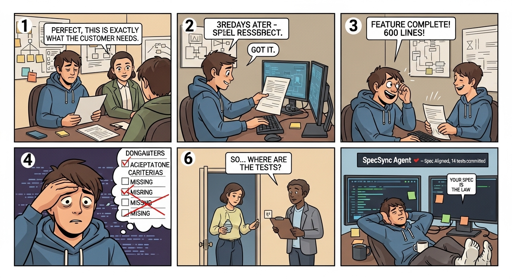

# SpecSync Agent
AI-Powered Architectural Guardrail for GitHub Repositories

SpecSync Agent is a GitHub Action that validates every code change against your feature specifications before tests are written or a PR is cleared for review.



[See it in action -- Demo vedio](https://youtu.be/uQp0aukxJ6Y)

[Detailed blog](https://medium.com/@khan.rafflesia/the-invisible-gap-between-what-we-planned-and-what-got-built-27f7bdd57714)

## What It Does

- **Reads** feature specs from your repository (`.specsync/specs/`) or GitHub Wiki
- **Compares** every git diff against the spec using Claude AI
- **Aligned**: generates tests from acceptance criteria, commits them to `/tests/`
- **Misaligned**: writes a detailed analysis report to `/feature-alignment/`, blocks the PR
- **Wiki trigger**: when an architect updates a spec, all blocked PRs are automatically re-evaluated

## Quick Start

```yaml
# .github/workflows/specsync.yml
- name: Run SpecSync Agent
  uses: specsync/specsync-agent@v1
  with:
    anthropic-api-key: ${{ secrets.ANTHROPIC_API_KEY }}
    github-token: ${{ secrets.GITHUB_TOKEN }}
    spec-directory: '.specsync/specs'
```

See [docs/setup.md](docs/setup.md) for the full setup guide.

## Repository Structure

```
specsync-agent/
  action.yml                     # Action metadata + inputs
  src/
    index.ts                     # Entry point — routes events to handlers
    diff-parser.ts               # Parse git diff → structured file list
    wiki-reader.ts               # Read spec files (flat file + Wiki API)
    alignment-engine.ts          # Call Claude API → alignment verdict
    impact-mapper.ts             # Dependency graph traversal
    test-generator.ts            # Generate test files from spec + verdict
    analysis-writer.ts           # Write misalignment analysis markdown
    pr-reporter.ts               # Post PR comments + set check status
    github-committer.ts          # Commit files to branch via git/API
    wiki-dispatch-handler.ts     # Handle wiki-spec-updated events
    types.ts                     # Shared TypeScript types
  relay/
    cloudflare-worker.js         # Wiki → dispatch relay (deploy once)
  .specsync/
    specs/
      feature-auth.md            # Example spec file
  .github/
    workflows/
      specsync.yml               # GitHub Actions workflow
  docs/
    setup.md                     # Setup guide
    wiki-template.md             # Feature spec page template
    access-control.md            # Access control model
```

## How Alignment Works

```
Developer pushes code
        ↓
SpecSync parses diff
        ↓
Reads spec pages for changed areas
        ↓
Claude API: diff + spec → verdict
        ↓
   ┌────┴────┐
✅ ALIGNED  ❌ MISALIGNED
   ↓             ↓
Tests       Analysis file
committed   committed to
to /tests/  /feature-alignment/
   ↓             ↓
PR: ✅ PASS  PR: ❌ BLOCKED
```

## Spec File Format

Place spec files in `.specsync/specs/feature-<name>.md`:

```markdown
# Feature: User Authentication
**Status:** active
**Version:** 2.1

## Acceptance Criteria
1. User can log in with email and password
2. Failed login after 5 attempts locks account for 15 minutes
3. Locked accounts return HTTP 423 with Retry-After header

## Edge Cases
- Login attempt with empty password field
- Concurrent login from two different devices

## API Contract
### POST /auth/login
Input:  { email: string, password: string }
Output: { accessToken: string, refreshToken: string }
Errors:
  401 — invalid credentials
  423 — account locked
```

See [docs/wiki-template.md](docs/wiki-template.md) for the full template.

## Configuration

| Input | Default | Description |
|-------|---------|-------------|
| `anthropic-api-key` | *required* | Anthropic API key |
| `spec-file` | *(none)* | Path to a single spec file |
| `spec-directory` | `.specsync/specs` | Directory of spec files |
| `test-framework` | `jest` | `jest`, `vitest`, `pytest`, `mocha` |
| `test-language` | `typescript` | `typescript`, `javascript`, `python` |
| `fail-on-misalignment` | `true` | Block PR on misalignment |
| `confidence-threshold` | `70` | Min confidence to act (0–100) |

## License

MIT
